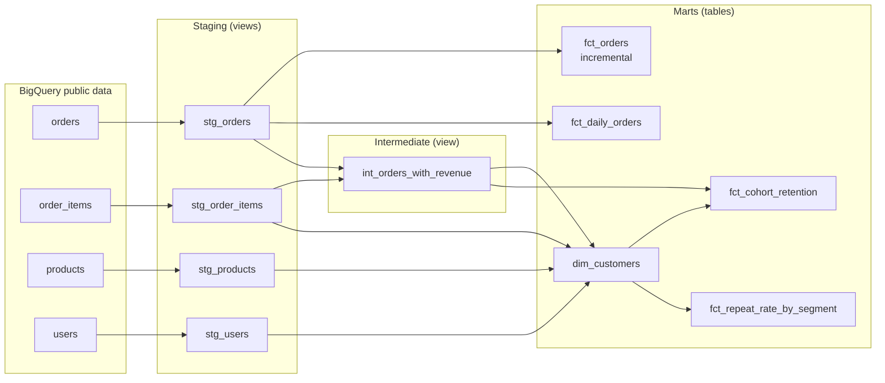

# thelook Analytics (dbt + BigQuery)

A dbt project that turns Google's public **thelook e-commerce** dataset into tested, analysis-ready models in BigQuery. I built it to practice analytics engineering patterns (layered modeling, incremental materializations, and data tests) alongside my day-to-day work as a data analyst.

## What it does

- **Sources:** four raw tables (`orders`, `order_items`, `products`, `users`) from `bigquery-public-data.thelook_ecommerce`, declared once in `_sources.yml`.
- **Staging layer (views):** one model per source that renames and cleans columns so everything downstream uses consistent names (for example, `num_of_item` becomes `num_items`).
- **Intermediate layer (view):** `int_orders_with_revenue` holds shared logic: one row per completed order with its revenue and the customer's order sequence (1st, 2nd, 3rd order). Cancelled/returned orders and the current partial month are excluded.
- **Marts layer (tables):**
  - `fct_orders`: one row per order, built as an **incremental** model so each run only processes new orders instead of rebuilding the whole table.
  - `fct_daily_orders`: daily order and item counts for trend reporting.
  - `dim_customers`: one row per customer with acquisition channel, age band, first-purchase category, lifetime orders and revenue, and a fair 90-day repeat flag (null until a customer has had 90 days to return).
  - `fct_cohort_retention`: monthly cohort retention (cohort month x months since first order) with cumulative revenue per customer.
  - `fct_repeat_rate_by_segment`: 90-day repeat rate and average lifetime revenue by channel, first-purchase category, and age band.
- **Tests (22):** `unique` and `not_null` on primary keys, `relationships` tests back to users, `accepted_values` on order status and segment type, and two custom SQL tests: one row per cohort-month, and retention between 0% and 100% (exactly 100% in month 0).
- **Privacy:** names and emails are dropped in staging since nothing downstream needs them.

## Lineage



## Findings

Full write-up with charts: **[Who Comes Back? Customer Retention in dbt](https://zzeller.com/projects/customer-retention)**

- **Most customers buy once.** About 6% place a second order within 90 days, and the first order is roughly 85% of first-year spend.
- **Acquisition channel doesn't predict repeat buying.** All five channels fall between 5.6% and 6.1% with overlapping confidence intervals (chi-square 1.9, 4 df). First-purchase category differences are consistent with noise (chi-square 23.6, 25 df).
- **Newer customers return faster.** Next-month retention rose from under 1% for 2019-2022 customers to 2.6% for 2025 customers.


## Project structure

```
models/
  staging/
    _sources.yml         # raw table declarations
    _stg_models.yml      # column tests for staging models
    stg_orders.sql
    stg_order_items.sql
    stg_products.sql
    stg_users.sql
  marts/
    fct_orders.sql       # incremental fact table
    fct_daily_orders.sql # daily aggregates
```

## Running it

Requires dbt Core with the BigQuery adapter and a `thelook_analytics` profile in `~/.dbt/profiles.yml` pointing at your own GCP project (the source data is public).

```bash
pip install dbt-bigquery
dbt debug   # check the connection
dbt run     # build all models
dbt test    # run data tests

# export the aggregate marts used for charts (run with the Python that has dbt installed)
"$(head -1 "$(which dbt)" | cut -c3-)" scripts/export_marts.py
```

## Next steps

- Add seeds and snapshots (tracking slowly changing user attributes)
- Generate and publish dbt docs
- Product-level marts (category margin, return rates)
