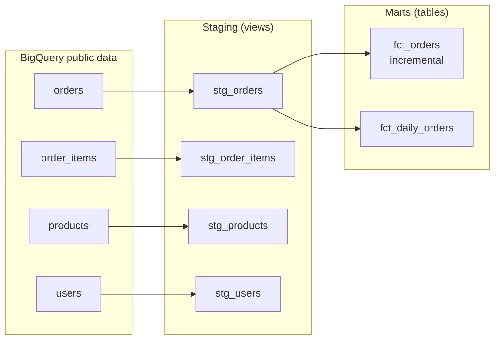

# thelook Analytics (dbt + BigQuery)

A dbt project that turns Google's public **thelook e-commerce** dataset into tested, analysis-ready models in BigQuery. I built it to practice analytics engineering patterns (layered modeling, incremental materializations, and data tests) alongside my day-to-day work as a data analyst.

## What it does

- **Sources:** four raw tables (`orders`, `order_items`, `products`, `users`) from `bigquery-public-data.thelook_ecommerce`, declared once in `_sources.yml`.
- **Staging layer (views):** one model per source that renames and cleans columns so everything downstream uses consistent names (for example, `num_of_item` becomes `num_items`).
- **Marts layer (tables):**
  - `fct_orders`: one row per order, built as an **incremental** model so each run only processes new orders instead of rebuilding the whole table.
  - `fct_daily_orders`: daily order and item counts for trend reporting.
- **Tests:** `unique` and `not_null` on primary keys, a `relationships` test that checks every order belongs to a real user, and `accepted_values` on order status.

## Lineage



## Project structure

```
models/
  staging/
    _sources.yml         # raw table declarations
    _stg_models.yml      # column tests for staging models
    stg_orders.sql
    stg_order_items.sql
    stg_products.sql
    stg_users.sql
  marts/
    fct_orders.sql       # incremental fact table
    fct_daily_orders.sql # daily aggregates
```

## Running it

Requires dbt Core with the BigQuery adapter and a `thelook_analytics` profile in `~/.dbt/profiles.yml` pointing at your own GCP project (the source data is public).

```bash
pip install dbt-bigquery
dbt debug   # check the connection
dbt run     # build all models
dbt test    # run data tests
```

## Next steps

- Add seeds and snapshots (tracking slowly changing user attributes)
- Generate and publish dbt docs
- Build customer and product marts (cohort retention, repeat purchase rate) and a dashboard on top of them
